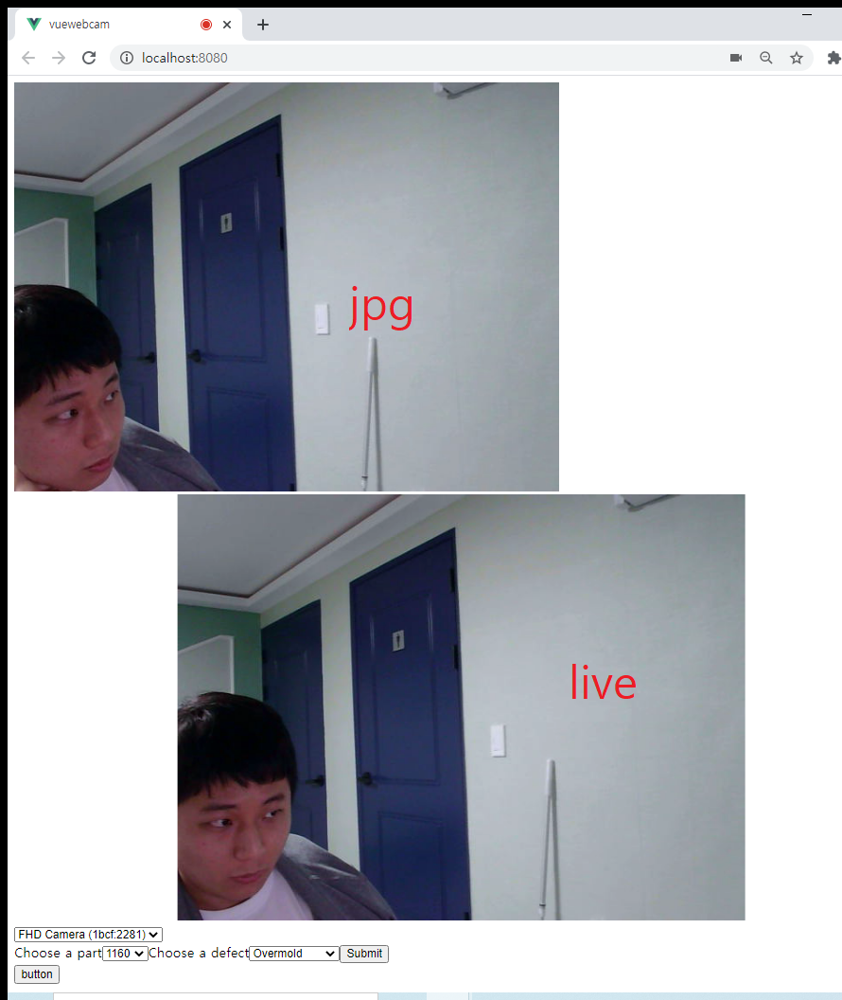
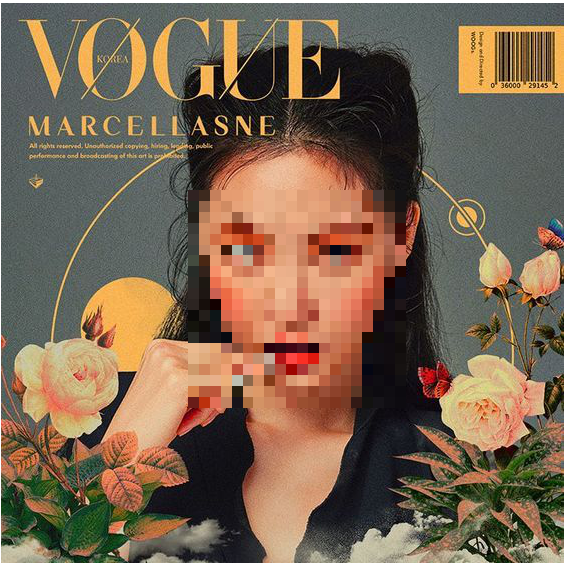
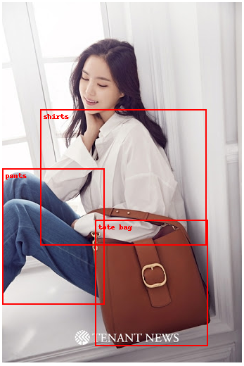
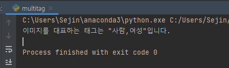

# 카카오 API 이용하기

> developers.kakao.com의 API 를 이용하여 image를 전송하고 이에 따른 정보를 REST API 방식으로 정보를 얻는다.


#### Step 1. Web 화면에서 이용자의 사진을 얻는다.

* Vue의 vue-web-cam 모듈을 이용해 캠 화면으로 사진을 캡쳐한다.

```
npm install vue-web-cam
```


* Methods 중 capture를 이용해 base64 encoded string 형태로 img를 저장한다.





#### Step 2. Backend에서 REST API 요청을 보낸다.

> URL : https://dapi.kakao.com/v2/vision/face/detect
>
> headers = { 'Authorization' : 'KakaoAK {APP_KEY}' }
>
> files = { 'image' :openfile }


* image에서 얼굴의 width, height값, 성별(0~1값 추측), 나이를 응답받는다.
* 눈썹, 눈, 턱, 입술, 코의 좌표(X, Y) 값을 응답받는다.


example)

{'result': {'width': 1080, 'height': 1350, 

'faces': [

{'facial_attributes': {'gender': {'male': 0.009239976294338703, 'female': 0.990760087966919}, 

'age': 23.560718536376953}, 

'facial_points': {

'left_eyebrow': [[0.5490330077098097, 0.2578931848221772], [0.5860177941721622, 0.2633577415155079], [0.6205546634476546, 0.27444441816631787], [0.6475256218304493, 0.293996941265351], [0.6619252706476902, 0.32009457572458605]], 

'jaw': [[0.35058272490740044, 0.24516868225872815], [0.323333713047048, 0.27962202761323235], [0.3022314655046972, 0.31681326362263157], [0.2860622278843301, 0.3553677454358916], [0.27545092823851247, 0.39454299999642867], [0.26999319526451104, 0.4310108456693793], [0.2733702613157234, 0.467005670131527], [0.28562626009105263, 0.4991456106957092], [0.3162038898687509, 0.5253583607047891], [0.36624284284919634, 0.5443031061447541], [0.42364010145383807, 0.551601496544285], [0.4823441514424404, 0.5489563245355299], [0.5375687881519413, 0.5366512842320846], [0.5855523475863609, 0.5128473875001439], [0.626570386683506, 0.4796896786046715], [0.66381483508385, 0.4428565924592301], [0.6975842309732172, 0.40389081174339153]], 

'left_eye': [[0.5396757586829632, 0.3165782182352295], [0.5653252298932165, 0.31552089773949143], [0.5871467098243119, 0.3257911514324272], [0.6033659981608314, 0.3414597915272569], [0.5788934328559414, 0.3388774494617613], [0.5571102404689817, 0.3294221535087003]], 

'lip': [[0.32825058812697, 0.4034792773593487], [0.3482128000584527, 0.4000882745027613], [0.36934075432889923, 0.40197078309976286], [0.3856904732400317, 0.41192477646475895], [0.4102088702179134, 0.42121223518460416], [0.430439105860267, 0.4396751681057698], [0.44897005918358684, 0.4615535590696554], [0.41510084531184277, 0.46292793355308287], [0.38514992332520104, 0.45789536324503655], [0.3585611426608645, 0.448813662995677], [0.3405912675683228, 0.4379079407677917], [0.3301589147679867, 0.42222204947532627], [0.33581755650593825, 0.4074260513575616], [0.358990787340361, 0.4148645619498199], [0.37783966246381984, 0.42429383284032035], [0.4053086641741485, 0.4363593797731511], [0.43792072310511254, 0.4558179457679734], [0.4007659320974145, 0.44078411137137924], [0.37217250632610455, 0.42974549038233495], [0.3531464858994959, 0.41965974949889373]], 

'nose': [[0.4816473661076183, 0.28614206455826613], [0.45987173965335526, 0.3059748454858254], [0.4392887396735454, 0.32605571049667414], [0.41786177843470124, 0.34588049377598673], [0.37950585745470666, 0.36092271828993455], [0.39159732989964713, 0.3697986775118797], [0.4051481115937134, 0.3795171196404026], [0.42647015275147476, 0.3870909186946045], [0.44806988762342376, 0.3950117650978047]], 

'right_eye': [[0.3878889871959136, 0.24639902057989418], [0.40951632573009267, 0.2464286345543997], [0.428205367799857, 0.25628750649016757], [0.4398831123689565, 0.27261010477565345], [0.4182446974837405, 0.26799733686750365], [0.3999778540818995, 0.2596530511840155]], 

'right_eyebrow': [[0.3913312358286715, 0.19319745432997715], [0.41685359064808675, 0.1898159623080823], [0.44027917913389203, 0.19719493206623595], [0.46113250312975856, 0.21174537643625918], [0.47587985779343095, 0.22969347274365712]]}, 'h': 0.3658077211733217, 

'yaw': 0.40763750672340393, 'class_idx': 0, 'score': 0.9999961853027344, 'w': 0.457259679723669, 'pitch': 0.026858996599912643, 'y': 0.1803625262225116, 'x': 0.23723704020182293, 'roll': -0.47843605279922485}]}}


#### Step 3. 이 정보들을 이용하여 image를 가공한다.

* 얼굴모양 모자이크 처리

  

* 입술을 따라 point 찍기

  


#### Step 4. 응용

> face detect api 이외에 Object Detect와 Multi Tag api를 사용해 본다.


* Object detection api

  

* multi tag api

  


##### Source

* https://www.npmjs.com/package/vue-web-cam
* https://developers.kakao.com/tool/rest-api/open/post/v2-vision-face-detect